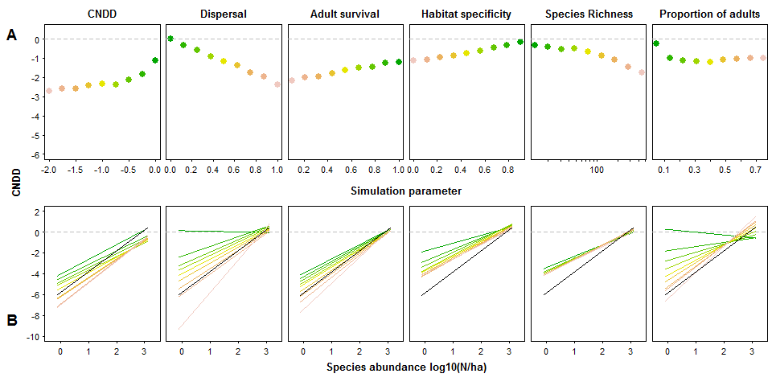

# Fig. 1
Hülsmann & Hartig  
February 14 2018  


## Load packages, functions and BCI data


```r
library(sads)
library(gnm)
library(MASS)
library(lme4)
library(mgcv)

source("../simulations/functions_data_simulation.R")
source("../simulations/functions_analyses.R")

load(file = "../Data/bciCounts.Rdata")
bciCounts$quadrat = rep(1:5000, times = length(unique(bciCounts$species)))
adult_all = rep(by(bciCounts$A, bciCounts$quadrat, sum), length(unique(bciCounts$species)))
recruit_all = rep(by(bciCounts$B, bciCounts$quadrat, sum), length(unique(bciCounts$species)))
bciCounts$b <- recruit_all - bciCounts$B
bciCounts$a <- adult_all - bciCounts$A

set.seed(123)
```


## Run simulations and analyses

Create settings for processes and community characteristics

```r
fig1 = list()

runs = 9
CNDD = seq(0,-2,length.out = runs)
dispersal = seq(0,1,length.out = runs)
adultSurvival = seq(1,0.1,length.out = runs)
suitability = seq(0.1, 1, length.out = runs)
richness = round(10^seq(1.1, 2.65, len = runs))
Aratio = seq(0.05, 0.75, length.out = runs)

vect = list(CNDD, dispersal, adultSurvival, 1-suitability, richness, Aratio)
names = c("CNDD", "Dispersal", "Adult survival", "Habitat specificity", "Species Richness", "Proportion of adults", "BCI")
```

Run analyses with simulated data using different CNDD settings

```r
fig1[[1]] = runAnalysesAbundance(which = "ricker", species = rep(200,runs), dispersal = rep(0.5, runs), adultSurvival = rep(1, runs), CNDD = CNDD, gaps = rep(1, runs), Aratio = rep(0.4, runs), ABsd =  rep(0, runs), suitability = rep(1, runs))
```

Run analyses with simulated data using different dispersal settings

```r
fig1[[2]] = runAnalysesAbundance(which = "ricker", species = rep(200,runs), dispersal = dispersal, adultSurvival = rep(1, runs), CNDD = rep(0, runs), gaps = rep(1, runs), Aratio = rep(0.4, runs), ABsd  = rep(0, runs), suitability = rep(1, runs))
```

Run analyses with simulated data using different adult survival settings

```r
fig1[[3]] = runAnalysesAbundance(which = "ricker", species = rep(200,runs), dispersal = rep(0.5, runs), adultSurvival = adultSurvival, CNDD = rep(0, runs), gaps = rep(1, runs), Aratio = rep(0.4, runs), ABsd = rep(0, runs), suitability = rep(1, runs))
```

Run analyses with simulated data using different habitat specificity settings

```r
fig1[[4]] = runAnalysesAbundance(which = "ricker", species = rep(200,runs), dispersal = rep(0.5, runs), adultSurvival = rep(1, runs), CNDD = rep(0, runs), gaps = rep(1, runs), Aratio = rep(0.4, runs), ABsd = rep(0, runs), suitability = suitability)
```

Run analyses with simulated data using different species richness settings

```r
fig1[[5]] = runAnalysesAbundance(which = "ricker", species = richness, dispersal = rep(0.5, runs), adultSurvival = rep(1, runs), CNDD = rep(0, runs), gaps = rep(1, runs), Aratio = rep(0.4, runs), ABsd  = rep(0, runs), suitability = rep(1, runs))
```

Run analyses with simulated data using different adult ratios

```r
fig1[[6]] = runAnalysesAbundance(which = "ricker", species = rep(200,runs), dispersal = rep(0.5, runs), adultSurvival = rep(1, runs), CNDD = rep(0, runs), gaps = rep(1, runs), Aratio = Aratio, ABsd = rep(0, runs), suitability = rep(1, runs))
```

Run analyses with real counts from the BCI data

```r
fig1[[length(fig1)+1]] = runAnalysis(which = "ricker", externalData = bciCounts)
```


## Fig. 1


```r
par(mfcol = c(2,6), las=1)
op <- par(mfcol = c(2,6), oma = c(2,4,0,0) + 0.1, mar = c(2,0,2,0)+0.3, las=1, mgp=c(1.5, 0.5, 0), lwd=75/75, cex.axis=3/3, cex.lab=2/3, tcl=(-0.2))
col = terrain.colors(runs+1)[1:runs]
for(j in 1:6){
  plot(vect[[j]], fig1[[j]]$summary[,1], xlab = "", ylab = "mean CNDD", ylim = c(-6,0.5), main = names[j], col = NA, bg = col, pch=21, cex=1.6, yaxt="n", xaxt = "n", log = ifelse(j==5, "x", ""))
  if(j!=5) axis(1)
  if(j==5) axis(1, at = 10^(1:3))
  if(j==5) axis(1, at = c(10*1:9, 100*1:9), labels = F)
  if(j==1) axis(2)
  abline(h = 0, col="grey", lty=2)
  plot(NULL, NULL, xlab = "", ylab = "CNDD", xlim = c(-0.4, 3.4), ylim = c(-10,2), yaxt="n")
  if(j==1) axis(2)
  abline(h = 0, col="grey", lty=2)
  clip(-0.1, 3.1, -100, 100)
  for(i in 1:runs) abline(fig1[[j]]$full[[i]]$lmfit, col = col[i], lwd=1.6)  
  abline(fig1[[length(fig1)]]$lmfit, lwd=1.5)
}
mtext(c("CNDD", "Simulation parameter", "Species abundance log10(N/ha)"), outer = T, side = c(2, 1, 1), las=0, line = c(2, -17.5, -0.2), cex = 0.8, font=2)
mtext(c("A", "B"), side = rep(3,2), c(-4, -32), at = c(-0.04, -0.04), outer = T, cex = 1.2, font=2)
```

<!-- -->

Fig. 1 Weighted mean CNDD (**A**) and CNDD-abundance correlations (**B**) estimated by the Ricker model with simulated data, varying ecological parameters (CNDD, dispersal, adult survival, habitat specificity), and community characteristics (species richness, proportion of adults). CNDD is zero except for the CNDD subplots. For details on the simulation settings see (4). Line colors correspond to parameter values in the upper subpanels; results for the Barro Colorado Island (BCI) forest plot are shown in black. Parameters estimation follows LaManna *et al*..


```
## png 
##   2
```

