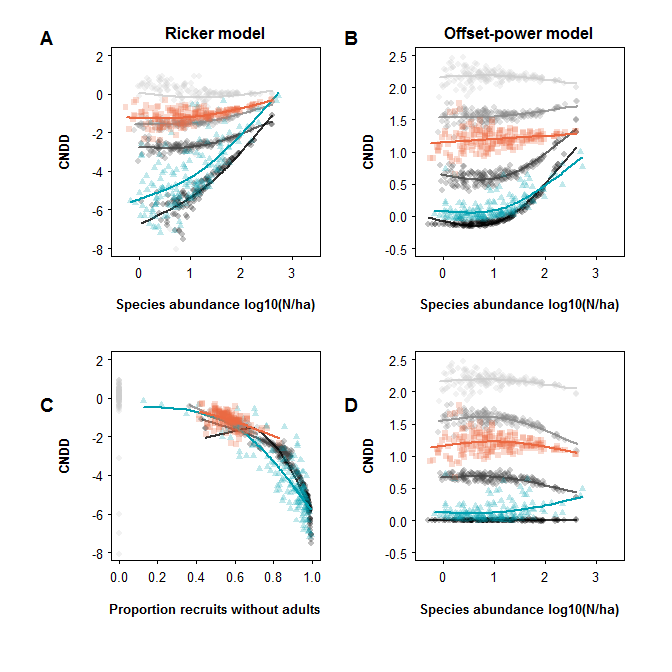

# Fig. 2
Hülsmann & Hartig  
February 15 2018  

## Load functions and packages


```r
library(sads)
```

```
## Loading required package: bbmle
```

```
## Loading required package: stats4
```

```r
library(gnm)
library(MASS)
library(lme4)
```

```
## Warning: package 'lme4' was built under R version 3.4.3
```

```
## Loading required package: Matrix
```

```
## Warning: package 'Matrix' was built under R version 3.4.3
```

```r
library(mgcv)
```

```
## Loading required package: nlme
```

```
## 
## Attaching package: 'nlme'
```

```
## The following object is masked from 'package:lme4':
## 
##     lmList
```

```
## This is mgcv 1.8-17. For overview type 'help("mgcv-package")'.
```

```r
source("functions_data_simulation.R")
source("functions_analyses.R")
set.seed(123)
```


## Run simulations 


```r
load(file = "../Data/bciCounts.Rdata")
bciCounts$quadrat = rep(1:5000, times = length(unique(bciCounts$species)))
adult_all = rep(by(bciCounts$A, bciCounts$quadrat, sum), length(unique(bciCounts$species)))
recruit_all = rep(by(bciCounts$B, bciCounts$quadrat, sum), length(unique(bciCounts$species)))
bciCounts$b <- recruit_all - bciCounts$B
bciCounts$a <- adult_all - bciCounts$A

fig2 = runAnalyses(abundanceDist = bci*12, numQuadrats= 5000, dispersal = c(0, 0.4, 0.8, Inf))
```

```
## [1] "running 0"
```

```
## Warning: Algorithm failed - no model could be estimated

## Warning: Algorithm failed - no model could be estimated

## Warning: Algorithm failed - no model could be estimated

## Warning: Algorithm failed - no model could be estimated

## Warning: Algorithm failed - no model could be estimated

## Warning: Algorithm failed - no model could be estimated

## Warning: Algorithm failed - no model could be estimated

## Warning: Algorithm failed - no model could be estimated

## Warning: Algorithm failed - no model could be estimated

## Warning: Algorithm failed - no model could be estimated

## Warning: Algorithm failed - no model could be estimated

## Warning: Algorithm failed - no model could be estimated

## Warning: Algorithm failed - no model could be estimated

## Warning: Algorithm failed - no model could be estimated

## Warning: Algorithm failed - no model could be estimated

## Warning: Algorithm failed - no model could be estimated

## Warning: Algorithm failed - no model could be estimated

## Warning: Algorithm failed - no model could be estimated

## Warning: Algorithm failed - no model could be estimated

## Warning: Algorithm failed - no model could be estimated

## Warning: Algorithm failed - no model could be estimated

## Warning: Algorithm failed - no model could be estimated

## Warning: Algorithm failed - no model could be estimated

## Warning: Algorithm failed - no model could be estimated

## Warning: Algorithm failed - no model could be estimated

## Warning: Algorithm failed - no model could be estimated

## Warning: Algorithm failed - no model could be estimated

## Warning: Algorithm failed - no model could be estimated

## Warning: Algorithm failed - no model could be estimated

## Warning: Algorithm failed - no model could be estimated

## Warning: Algorithm failed - no model could be estimated

## Warning: Algorithm failed - no model could be estimated

## Warning: Algorithm failed - no model could be estimated

## Warning: Algorithm failed - no model could be estimated

## Warning: Algorithm failed - no model could be estimated
```

```
## [1] "running 0.4"
```

```
## Warning: Algorithm failed - no model could be estimated

## Warning: Algorithm failed - no model could be estimated

## Warning: Algorithm failed - no model could be estimated

## Warning: Algorithm failed - no model could be estimated

## Warning: Algorithm failed - no model could be estimated

## Warning: Algorithm failed - no model could be estimated

## Warning: Algorithm failed - no model could be estimated

## Warning: Algorithm failed - no model could be estimated

## Warning: Algorithm failed - no model could be estimated

## Warning: Algorithm failed - no model could be estimated

## Warning: Algorithm failed - no model could be estimated

## Warning: Algorithm failed - no model could be estimated

## Warning: Algorithm failed - no model could be estimated

## Warning: Algorithm failed - no model could be estimated

## Warning: Algorithm failed - no model could be estimated

## Warning: Algorithm failed - no model could be estimated

## Warning: Algorithm failed - no model could be estimated

## Warning: Algorithm failed - no model could be estimated

## Warning: Algorithm failed - no model could be estimated

## Warning: Algorithm failed - no model could be estimated

## Warning: Algorithm failed - no model could be estimated

## Warning: Algorithm failed - no model could be estimated

## Warning: Algorithm failed - no model could be estimated

## Warning: Algorithm failed - no model could be estimated

## Warning: Algorithm failed - no model could be estimated

## Warning: Algorithm failed - no model could be estimated

## Warning: Algorithm failed - no model could be estimated

## Warning: Algorithm failed - no model could be estimated

## Warning: Algorithm failed - no model could be estimated

## Warning: Algorithm failed - no model could be estimated

## Warning: Algorithm failed - no model could be estimated

## Warning: Algorithm failed - no model could be estimated

## Warning: Algorithm failed - no model could be estimated

## Warning: Algorithm failed - no model could be estimated

## Warning: Algorithm failed - no model could be estimated

## Warning: Algorithm failed - no model could be estimated

## Warning: Algorithm failed - no model could be estimated

## Warning: Algorithm failed - no model could be estimated

## Warning: Algorithm failed - no model could be estimated

## Warning: Algorithm failed - no model could be estimated

## Warning: Algorithm failed - no model could be estimated

## Warning: Algorithm failed - no model could be estimated

## Warning: Algorithm failed - no model could be estimated

## Warning: Algorithm failed - no model could be estimated

## Warning: Algorithm failed - no model could be estimated

## Warning: Algorithm failed - no model could be estimated

## Warning: Algorithm failed - no model could be estimated

## Warning: Algorithm failed - no model could be estimated

## Warning: Algorithm failed - no model could be estimated

## Warning: Algorithm failed - no model could be estimated

## Warning: Algorithm failed - no model could be estimated

## Warning: Algorithm failed - no model could be estimated

## Warning: Algorithm failed - no model could be estimated

## Warning: Algorithm failed - no model could be estimated

## Warning: Algorithm failed - no model could be estimated

## Warning: Algorithm failed - no model could be estimated

## Warning: Algorithm failed - no model could be estimated

## Warning: Algorithm failed - no model could be estimated

## Warning: Algorithm failed - no model could be estimated

## Warning: Algorithm failed - no model could be estimated

## Warning: Algorithm failed - no model could be estimated

## Warning: Algorithm failed - no model could be estimated

## Warning: Algorithm failed - no model could be estimated

## Warning: Algorithm failed - no model could be estimated
```

```
## [1] "running 0.8"
```

```
## Warning: Algorithm failed - no model could be estimated

## Warning: Algorithm failed - no model could be estimated

## Warning: Algorithm failed - no model could be estimated

## Warning: Algorithm failed - no model could be estimated

## Warning: Algorithm failed - no model could be estimated

## Warning: Algorithm failed - no model could be estimated

## Warning: Algorithm failed - no model could be estimated

## Warning: Algorithm failed - no model could be estimated

## Warning: Algorithm failed - no model could be estimated

## Warning: Algorithm failed - no model could be estimated

## Warning: Algorithm failed - no model could be estimated

## Warning: Algorithm failed - no model could be estimated

## Warning: Algorithm failed - no model could be estimated

## Warning: Algorithm failed - no model could be estimated

## Warning: Algorithm failed - no model could be estimated

## Warning: Algorithm failed - no model could be estimated

## Warning: Algorithm failed - no model could be estimated

## Warning: Algorithm failed - no model could be estimated

## Warning: Algorithm failed - no model could be estimated

## Warning: Algorithm failed - no model could be estimated

## Warning: Algorithm failed - no model could be estimated

## Warning: Algorithm failed - no model could be estimated

## Warning: Algorithm failed - no model could be estimated

## Warning: Algorithm failed - no model could be estimated

## Warning: Algorithm failed - no model could be estimated

## Warning: Algorithm failed - no model could be estimated

## Warning: Algorithm failed - no model could be estimated

## Warning: Algorithm failed - no model could be estimated

## Warning: Algorithm failed - no model could be estimated

## Warning: Algorithm failed - no model could be estimated

## Warning: Algorithm failed - no model could be estimated

## Warning: Algorithm failed - no model could be estimated

## Warning: Algorithm failed - no model could be estimated

## Warning: Algorithm failed - no model could be estimated

## Warning: Algorithm failed - no model could be estimated

## Warning: Algorithm failed - no model could be estimated

## Warning: Algorithm failed - no model could be estimated

## Warning: Algorithm failed - no model could be estimated

## Warning: Algorithm failed - no model could be estimated

## Warning: Algorithm failed - no model could be estimated

## Warning: Algorithm failed - no model could be estimated

## Warning: Algorithm failed - no model could be estimated

## Warning: Algorithm failed - no model could be estimated

## Warning: Algorithm failed - no model could be estimated

## Warning: Algorithm failed - no model could be estimated

## Warning: Algorithm failed - no model could be estimated

## Warning: Algorithm failed - no model could be estimated

## Warning: Algorithm failed - no model could be estimated

## Warning: Algorithm failed - no model could be estimated

## Warning: Algorithm failed - no model could be estimated

## Warning: Algorithm failed - no model could be estimated

## Warning: Algorithm failed - no model could be estimated

## Warning: Algorithm failed - no model could be estimated

## Warning: Algorithm failed - no model could be estimated

## Warning: Algorithm failed - no model could be estimated

## Warning: Algorithm failed - no model could be estimated

## Warning: Algorithm failed - no model could be estimated

## Warning: Algorithm failed - no model could be estimated

## Warning: Algorithm failed - no model could be estimated

## Warning: Algorithm failed - no model could be estimated

## Warning: Algorithm failed - no model could be estimated

## Warning: Algorithm failed - no model could be estimated

## Warning: Algorithm failed - no model could be estimated

## Warning: Algorithm failed - no model could be estimated

## Warning: Algorithm failed - no model could be estimated

## Warning: Algorithm failed - no model could be estimated

## Warning: Algorithm failed - no model could be estimated

## Warning: Algorithm failed - no model could be estimated

## Warning: Algorithm failed - no model could be estimated
```

```
## [1] "running Inf"
```

```
## Warning: Algorithm failed - no model could be estimated

## Warning: Algorithm failed - no model could be estimated

## Warning: Algorithm failed - no model could be estimated

## Warning: Algorithm failed - no model could be estimated

## Warning: Algorithm failed - no model could be estimated

## Warning: Algorithm failed - no model could be estimated

## Warning: Algorithm failed - no model could be estimated

## Warning: Algorithm failed - no model could be estimated

## Warning: Algorithm failed - no model could be estimated

## Warning: Algorithm failed - no model could be estimated

## Warning: Algorithm failed - no model could be estimated

## Warning: Algorithm failed - no model could be estimated

## Warning: Algorithm failed - no model could be estimated

## Warning: Algorithm failed - no model could be estimated

## Warning: Algorithm failed - no model could be estimated

## Warning: Algorithm failed - no model could be estimated

## Warning: Algorithm failed - no model could be estimated

## Warning: Algorithm failed - no model could be estimated

## Warning: Algorithm failed - no model could be estimated

## Warning: Algorithm failed - no model could be estimated

## Warning: Algorithm failed - no model could be estimated

## Warning: Algorithm failed - no model could be estimated

## Warning: Algorithm failed - no model could be estimated

## Warning: Algorithm failed - no model could be estimated

## Warning: Algorithm failed - no model could be estimated

## Warning: Algorithm failed - no model could be estimated

## Warning: Algorithm failed - no model could be estimated

## Warning: Algorithm failed - no model could be estimated

## Warning: Algorithm failed - no model could be estimated

## Warning: Algorithm failed - no model could be estimated

## Warning: Algorithm failed - no model could be estimated

## Warning: Algorithm failed - no model could be estimated

## Warning: Algorithm failed - no model could be estimated

## Warning: Algorithm failed - no model could be estimated

## Warning: Algorithm failed - no model could be estimated

## Warning: Algorithm failed - no model could be estimated

## Warning: Algorithm failed - no model could be estimated

## Warning: Algorithm failed - no model could be estimated

## Warning: Algorithm failed - no model could be estimated

## Warning: Algorithm failed - no model could be estimated
```

```
## Warning in gnmFit(modelTools = modelTools, y = y, constrain = constrain, : Fitting algorithm has either not converged or converged
## to a non-solution of the likelihood equations.
## Use exitInfo() for numerical details of last iteration.
```

```
## Warning: Algorithm failed - no model could be estimated

## Warning: Algorithm failed - no model could be estimated

## Warning: Algorithm failed - no model could be estimated

## Warning: Algorithm failed - no model could be estimated

## Warning: Algorithm failed - no model could be estimated

## Warning: Algorithm failed - no model could be estimated

## Warning: Algorithm failed - no model could be estimated

## Warning: Algorithm failed - no model could be estimated

## Warning: Algorithm failed - no model could be estimated

## Warning: Algorithm failed - no model could be estimated

## Warning: Algorithm failed - no model could be estimated

## Warning: Algorithm failed - no model could be estimated

## Warning: Algorithm failed - no model could be estimated

## Warning: Algorithm failed - no model could be estimated

## Warning: Algorithm failed - no model could be estimated

## Warning: Algorithm failed - no model could be estimated

## Warning: Algorithm failed - no model could be estimated

## Warning: Algorithm failed - no model could be estimated

## Warning: Algorithm failed - no model could be estimated

## Warning: Algorithm failed - no model could be estimated

## Warning: Algorithm failed - no model could be estimated

## Warning: Algorithm failed - no model could be estimated

## Warning: Algorithm failed - no model could be estimated

## Warning: Algorithm failed - no model could be estimated

## Warning: Algorithm failed - no model could be estimated

## Warning: Algorithm failed - no model could be estimated

## Warning: Algorithm failed - no model could be estimated

## Warning: Algorithm failed - no model could be estimated

## Warning: Algorithm failed - no model could be estimated

## Warning: Algorithm failed - no model could be estimated
```

```r
fig2[[5]] = runAnalysis(externalData = bciCounts)
```

```
## Warning: Algorithm failed - no model could be estimated
```

```r
names(fig2)[5] = "BCI"

fig2[[6]] = runAnalysis(abundanceDist=bci*12, numQuadrats= 5000, dispersal = 0.1, theta = 1, adultSurvival = "LaManna")
```

```
## Warning: Algorithm failed - no model could be estimated

## Warning: Algorithm failed - no model could be estimated

## Warning: Algorithm failed - no model could be estimated

## Warning: Algorithm failed - no model could be estimated

## Warning: Algorithm failed - no model could be estimated

## Warning: Algorithm failed - no model could be estimated

## Warning: Algorithm failed - no model could be estimated

## Warning: Algorithm failed - no model could be estimated

## Warning: Algorithm failed - no model could be estimated

## Warning: Algorithm failed - no model could be estimated

## Warning: Algorithm failed - no model could be estimated

## Warning: Algorithm failed - no model could be estimated

## Warning: Algorithm failed - no model could be estimated

## Warning: Algorithm failed - no model could be estimated

## Warning: Algorithm failed - no model could be estimated

## Warning: Algorithm failed - no model could be estimated

## Warning: Algorithm failed - no model could be estimated

## Warning: Algorithm failed - no model could be estimated

## Warning: Algorithm failed - no model could be estimated

## Warning: Algorithm failed - no model could be estimated

## Warning: Algorithm failed - no model could be estimated

## Warning: Algorithm failed - no model could be estimated

## Warning: Algorithm failed - no model could be estimated

## Warning: Algorithm failed - no model could be estimated
```

```r
names(fig2)[6] = "LaManna"
```

## Fig. 2


```r
gr <- seq(0.8, 0, length.out = 4)
col = c(rgb(gr, gr, gr, 0.25),  rgb(0, 160, 176, alpha = 0.25*255, max = 255), rgb(235, 104, 65, alpha = 0.25*255, max = 255))
col_full = c(rgb(gr, gr, gr, 0.8),  rgb(0, 160, 176, max = 255), rgb(235, 104, 65, max = 255))
pch = c(rep(16,4), 17,15)


oldpar <- par(mfrow = c(2,2), oma = c(3,3,1,1), mar = c(4,4,2,2), las=1, mgp=c(2.5, 0.5, 0), lwd=75/75, cex.axis=3/3, cex.lab=1, font.lab=2, tcl=(-0.2))

for(j in 1:6) {
  x <- log10(fig2[[j]]$abundance)[fig2[[j]]$RickerLaManna$CNDD > -10]
  y <- fig2[[j]]$RickerLaManna$CNDD[fig2[[j]]$RickerLaManna$CNDD > -10]
  if (j == 1) {
    plot(x, y, main = "Ricker model", xlim = c(-0.4, 3.4),  ylim = c(-8,2), col = col[1], pch=pch[1], xlab = "Species abundance log10(N/ha)", ylab = "CNDD")
  } else {
    points(x, y, col = col[j], cex=1, pch=pch[j])    
  }
  smo <- gam(y ~ s(x, k = 3))
  smo_fit <- predict(smo, newdata = data.frame(x=sort(unique(x))), type = "response")
  lines(sort(unique(x)), smo_fit, col=col_full[j], lwd=2)

}


for(j in 1:6) {
  x <- log10(fig2[[j]]$abundance)
  y <- fig2[[j]]$PowerLaManna$CNDD
  if (j == 1) {
    plot(x, y, main = "Offset-power model", xlim = c(-0.4, 3.4),  ylim = c(-0.5,2.5), col = col[1], pch=pch[1], cex=1, xlab = "Species abundance log10(N/ha)", ylab = "CNDD")
    meanA = seq(min(fig2[[j]]$abundanceA), max(fig2[[j]]$abundanceA), length.out = 20)/10000
    meanB = seq(min(fig2[[j]]$abundanceB), max(fig2[[j]]$abundanceB), length.out = 20)/10000
    estCNDD = log10(meanB + 1)/log10(meanA + 1)
    lines(log10(meanA*50000), estCNDD)
  } else {
    points(x, y, col = col[j], cex=1, pch=pch[j])    
  }
  smo <- gam(y ~ s(x, k=3))
  smo_fit <- predict(smo, newdata = data.frame(x=sort(unique(x))), type = "response")
  lines(sort(unique(x)), smo_fit, col=col_full[j], lwd=2)
  
}


for(j in 1:6) {
  x <- fig2[[j]]$zerosOnes[fig2[[j]]$RickerLaManna$CNDD > -10]
  y <- fig2[[j]]$RickerLaManna$CNDD[fig2[[j]]$RickerLaManna$CNDD > -10]
  if (j == 1) {
    plot(x, y, main = "",  xlim = c(0,1), ylim = c(-8,2), col = col[1], pch=pch[1], cex=1, xlab = "Proportion recruits without adults", ylab = "CNDD")
  } else {
    points(x, y, col = col[j], cex=1, pch=pch[j])    
  }
  if (j != 1) {
    smo <- gam(y ~ s(x, k=3))
    smo_fit <- predict(smo, newdata = data.frame(x=sort(unique(x))), type = "response")
    lines(sort(unique(x)), smo_fit, col=col_full[j], lwd=2)
  }

}


for(j in 1:6) {
  x <- log10(fig2[[j]]$abundance)
  y <- fig2[[j]]$PowerRandomR$CNDD
  if (j == 1) {
    plot(x, y, main = "", xlim = c(-0.4, 3.4),  ylim = c(-0.5,2.5), col = col[1], pch=pch[1], cex=1, xlab = "Species abundance log10(N/ha)", ylab = "CNDD")
  } else {
    points(x, y, col = col[j], cex=1, pch=pch[j])    
  }
  smo <- gam(y ~ s(x, k=3))
  smo_fit <- predict(smo, newdata = data.frame(x=sort(unique(x))), type = "response")
  lines(sort(unique(x)), smo_fit, col=col_full[j], lwd=2)
}
 
mtext(c("A", "B", "C", "D"), side = rep(3,4), c(-2,-2,-25, -25), at = c(0,0.5, 0, 0.5), outer = T, cex = 1.2, font=2)
```

<!-- -->


Fig. 2 Estimated CNDD vs. abundance (Log10 N/ha) per species from the Ricker model (**A**) and the offset-power model (**B**) at the 10x10m scale. Gray circles result from data simulated randomly without CNDD and changing spatial association between adults and recruits, ranging from perfect spatial coupling (lightest gray) to no spatial association (black). Blue triangles depict CNDD estimates for the tropical BCI plot; orange squares the simulation model without CNDD used in the appendix of LaManna *et al*.. For the Ricker model, CNDD bias is highly correlated with the proportion of corrected adult counts (**C**). Fitting a species-specific recruit-to-adult ratio in the offset-power model removes the CNDD-abundance correlation (**D**).
